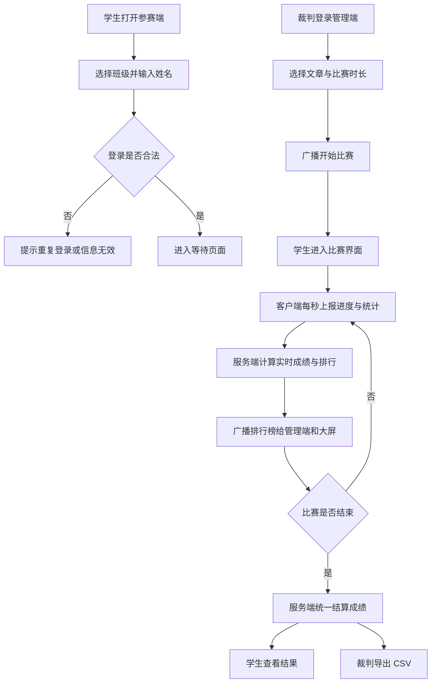

## 1. 产品概述
南湾沙塘布学校科技节班级打字比赛网页系统是一套运行在校园局域网内的实时比赛平台，支持学生参赛、裁判控制、投影大屏展示与成绩导出。
- 目标用户为学生选手、裁判老师、现场观众与班主任，解决传统纸面或单机打字比赛无法统一计时、实时排行和集中统计的问题。
- 产品价值在于提升比赛组织效率、保证计分规则统一可追溯，并增强科技节活动的现场展示效果。

## 2. 核心功能

### 2.1 用户角色
| 角色 | 进入方式 | 核心权限 |
|------|----------|----------|
| 参赛选手 | 选择班级并填写姓名登录 | 等待比赛、参加打字、查看个人与班级成绩 |
| 裁判老师 | 输入管理密码登录 | 选择文章、设置时长、控制比赛、查看在线状态、导出成绩 |
| 观众/大屏 | 直接打开排行榜页面 | 查看班级总分和个人实时排行榜 |

### 2.2 功能模块
1. **参赛端页面**：登录、等待、比赛、结果展示。
2. **管理端页面**：管理登录、比赛控制、选手在线状态、实时排行榜、导出成绩。
3. **排行榜大屏**：班级总分柱状图、个人速度榜 Top10、名次变化高亮。

### 2.3 页面详情
| 页面名称 | 模块名称 | 功能说明 |
|-----------|-----------|-----------|
| 参赛端 | 登录区 | 选择班级、输入姓名、校验同班级不可重复姓名登录 |
| 参赛端 | 等待区 | 展示等待提示、连接状态、比赛开始后自动切换 |
| 参赛端 | 比赛区 | 显示顶部信息栏、原文字符高亮、隐藏输入捕获、进度条、违规提示 |
| 参赛端 | 结果区 | 展示速度、准确率、得分、退格次数、警告次数、违规状态、班级总分与排名 |
| 管理端 | 登录区 | 输入简单密码进入控制台 |
| 管理端 | 控制面板 | 选择文章、设置比赛时长、开始、暂停、继续、提前结束 |
| 管理端 | 选手监控区 | 展示在线状态、断线提示、当前输入进度、心跳时间 |
| 管理端 | 排行榜区 | 班级总分排行、个人 Top10、比赛结束后固定排名 |
| 管理端 | 导出区 | 导出班级总分和个人成绩为 CSV |
| 大屏页 | 班级图表 | 动态显示各班总分柱状图 |
| 大屏页 | 个人榜单 | 展示个人实时速度榜和名次变化闪烁效果 |

## 3. 核心流程
学生进入参赛端后选择班级并填写姓名，系统校验身份唯一性和会话有效性，成功后进入等待页面。裁判在管理端选择文章与比赛时间后开始比赛，服务器统一记录开始时间并通过 Socket.IO 广播开始事件。选手端在比赛过程中按秒上报击键统计、进度、退格和警告信息，服务器负责计时、排行和成绩计算，并持续广播排行榜给管理端和大屏页。比赛时间到、裁判提前结束或违规取消后，服务器统一结算并广播最终成绩，裁判可导出 CSV。

## 4. 用户界面设计
### 4.1 设计风格
- 主色调采用深蓝黑背景、青蓝霓虹强调色、黄色当前字符高亮、红色错误提示。
- 按钮风格采用圆角矩形、轻微发光描边、悬停时上浮与阴影增强。
- 字体使用 `Consolas`、`Microsoft YaHei` 和 `monospace` 组合，保证中文与英文混合内容清晰可读。
- 布局采用桌面优先双栏或分区面板风格，比赛页尽量全屏、低干扰。
- 图标与状态提示采用简洁线性风格，不依赖复杂图片资源。

### 4.2 页面设计概览
| 页面名称 | 模块名称 | UI 元素 |
|-----------|-----------|-----------|
| 参赛端 | 登录区 | 居中卡片、班级选择器、姓名输入框、进入按钮、连接状态徽标 |
| 参赛端 | 比赛区顶部栏 | 选手信息卡、剩余时间、速度、准确率、进度条、违规计数 |
| 参赛端 | 原文显示区 | 深色面板、等宽字体、逐字符渲染、当前字符黄色背景、错误字符红色闪动 |
| 参赛端 | 提示区 | 禁止粘贴提示、断线提示、失焦警告提示 |
| 管理端 | 控制面板 | 文章下拉框、时长输入框、控制按钮组、比赛状态标签 |
| 管理端 | 在线选手表格 | 班级、姓名、连接状态、心跳时间、正确字数、错误击键、警告次数 |
| 管理端 | 排行榜区 | 左侧柱状图、右侧榜单卡片、排名变动高亮 |
| 大屏页 | 展示面板 | 超大标题、班级总分图、Top10 榜单、最终定榜标识 |

### 4.3 响应式策略
- 采用桌面优先设计，适配教室电脑、教师办公机、投影大屏。
- 在平板和小屏设备上缩减非关键边距，信息卡自动换行。
- 比赛页始终保证原文区和状态栏优先显示，避免横向滚动。

### 4.4 特殊交互要求
- 比赛页禁止复制、粘贴、剪切、右键菜单与拼写检查。
- 页面失焦时立即记录警告并弹出醒目提示，超过 3 次时成绩作废。
- 输入光标始终维持在末尾，防止修改中间文本。
- 错误字符需短暂抖动，增强即时反馈。
