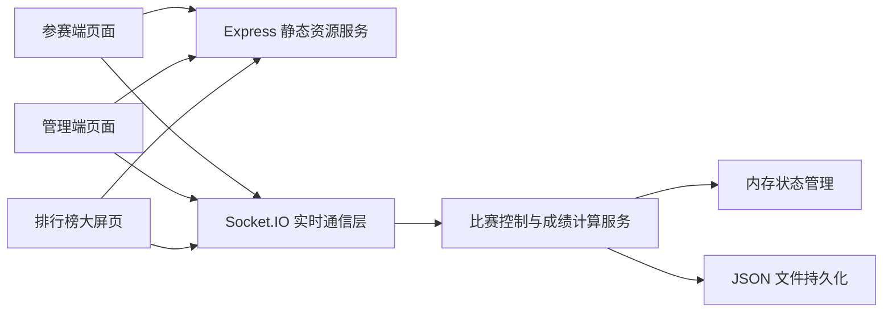
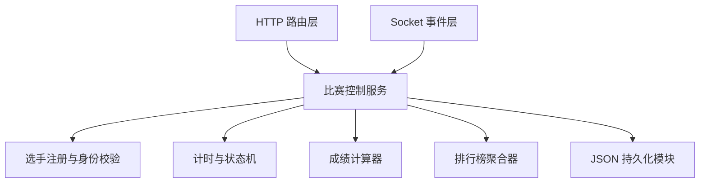
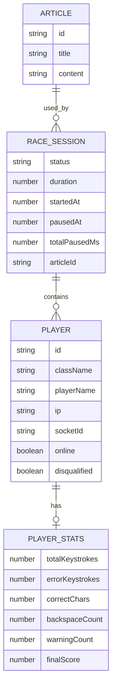

## 1. 架构设计


## 2. 技术说明
- 前端：原生 HTML + CSS + JavaScript
- 后端：Node.js + Express + Socket.IO
- 数据存储：服务端内存状态 + 本地 JSON 文件快照
- 导出能力：Node.js 原生文本拼接生成 CSV
- 实时通信：Socket.IO 事件广播与房间机制

## 3. 路由定义
| 路由 | 用途 |
|------|------|
| `/` | 默认跳转到参赛端页面 |
| `/player.html` | 参赛端页面 |
| `/admin.html` | 管理端页面 |
| `/screen.html` | 排行榜大屏页面 |
| `/api/config` | 获取系统基础配置与班级列表 |
| `/api/articles` | 获取文章列表 |
| `/api/export` | 导出当前成绩 CSV |
| `/api/admin/login` | 管理端密码登录 |

## 4. API 定义

### 4.1 获取系统配置
```ts
type ConfigResponse = {
  classes: string[];
  defaultDuration: number;
  heartbeatInterval: number;
  disconnectThreshold: number;
  adminPasswordHint: string;
};
```

### 4.2 获取文章列表
```ts
type ArticleItem = {
  id: string;
  title: string;
  content: string;
};

type ArticlesResponse = {
  articles: ArticleItem[];
};
```

### 4.3 管理员登录
```ts
type AdminLoginRequest = {
  password: string;
};

type AdminLoginResponse = {
  success: boolean;
  token?: string;
  message?: string;
};
```

### 4.4 导出成绩
```ts
type ExportResponse = string;
```

### 4.5 Socket 事件
```ts
type JoinPlayerPayload = {
  className: string;
  playerName: string;
};

type StartRacePayload = {
  articleId: string;
  articleTitle: string;
  articleContent: string;
  duration: number;
  startedAt: number;
};

type UpdateProgressPayload = {
  totalKeystrokes: number;
  errorKeystrokes: number;
  correctChars: number;
  backspaceCount: number;
  warningCount: number;
  typedLength: number;
  currentInput: string;
};

type LeaderboardUpdatePayload = {
  status: "waiting" | "running" | "paused" | "ended";
  remainingSeconds: number;
  classes: Array<{
    className: string;
    totalScore: number;
    playerCount: number;
    rank: number;
  }>;
  players: Array<{
    className: string;
    playerName: string;
    speed: number;
    accuracy: number;
    score: number;
    warningCount: number;
    disqualified: boolean;
    rank: number;
  }>;
};
```

## 5. 服务端架构图


## 6. 数据模型

### 6.1 数据模型定义


### 6.2 数据定义说明
- `articles`：预置 3 篇以上科技主题中英文混合短文，服务启动时直接加载。
- `raceState`：当前比赛状态，包含文章、时长、开始时间、暂停时间、结束时间和状态机标识。
- `players`：在线选手映射表，键值包含班级、姓名、IP、Socket ID、最近心跳时间与统计信息。
- `resultsSnapshot`：比赛结束时固化的排行榜结果，用于大屏固定展示和 CSV 导出。
- `storage/results.json`：可选落盘文件，保存最近一次比赛结果与历史导出快照。

## 7. 关键实现约束
- 服务端是唯一计时源，客户端倒计时仅用于展示，不作为最终成绩依据。
- 同一班级内姓名不可重复登录，服务端额外记录 IP 和 Socket 会话用于防作弊。
- 客户端每 2 秒发送一次心跳，服务端若连续超过 5 秒未收到则标记为离线并通知管理端。
- 个人得分公式为 `速度 × 准确率`，其中准确率按 0 到 1 参与计算；退格次数超过 5 次额外扣 2 分；失焦超过 3 次直接取消成绩。
- 排名规则为先班级总分再个人成绩，班级总分为该班有效选手得分总和。
